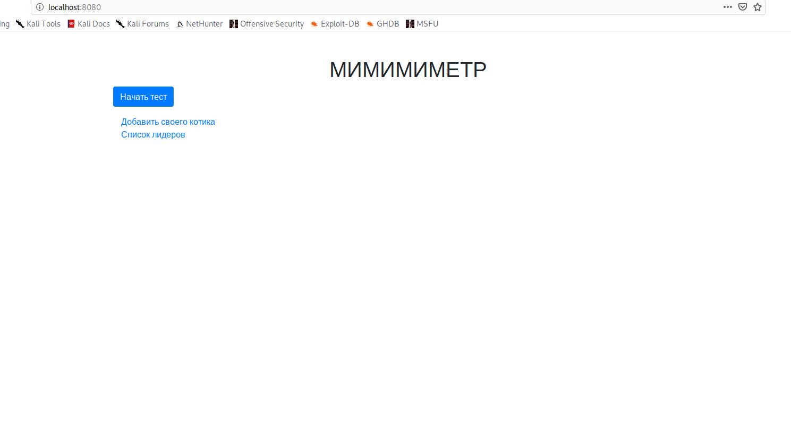
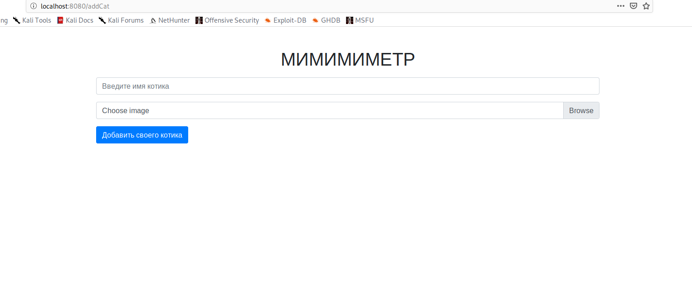
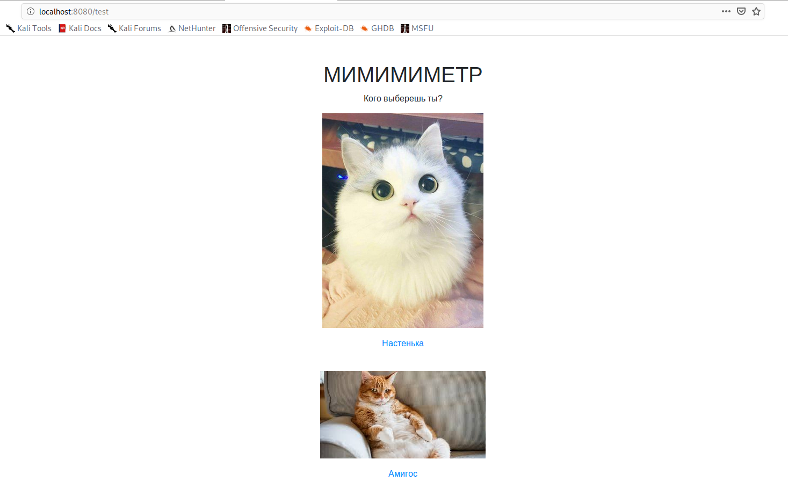
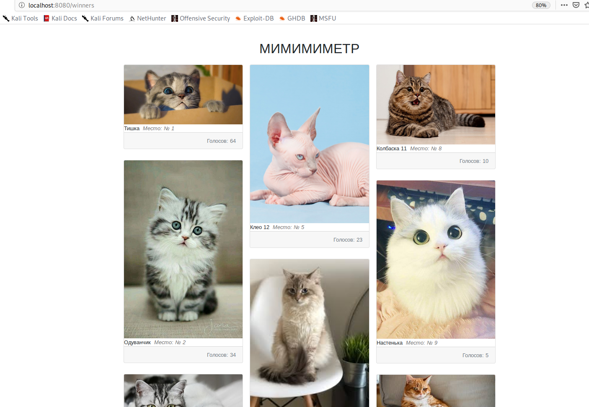

# Mimimimetr
Тестовое задание 1

Сделано на фреймворке Spring с использованием Базы данных PostgreSQL для сохранения котиков.
В качестве шаблонизатора html я взял Freemarker.

Соответственно в application.properties нужно изменить данные для соединения с БД
и также изменить путь для сохранения картинок котиков upload.path.

Скриншоты:
​
​
​
​

Я не добавил миграцию БД, чтобы при первом запуске уже были созданы котики. 
Но я добавил страницу по добавлению котиков в базу вручную, если вдруг кто то захочет выставить своего котика:)

